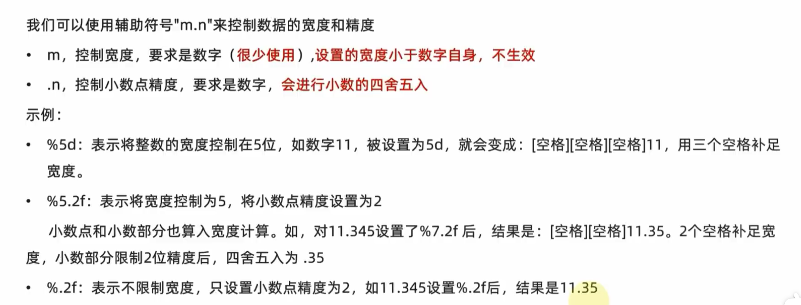
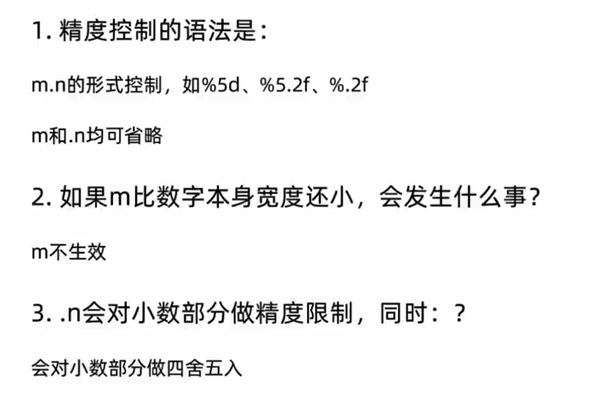
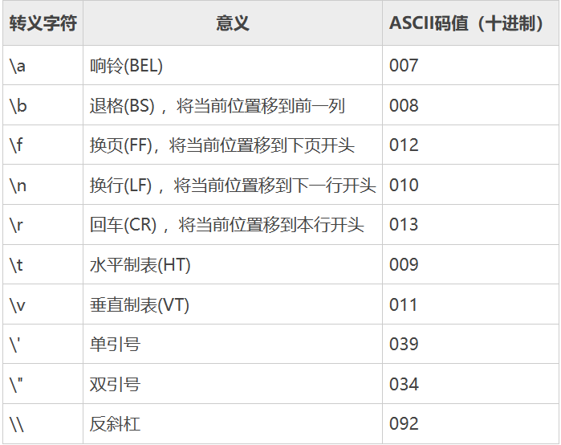

- 编程
	- PYTHON
	  collapsed:: true
		- # PYTHON第一章
		  collapsed:: true
			- ## python的起源
			  collapsed:: true
				- Python语言的起源可以追溯到上个世纪90年代初，在荷兰的Guido van Rossum开发了它。Guido当时想要创建一种简单易学、具有良好的可读性和可维护性，并且适合完成各种编程任务的语言，因此Python应运而生。这门语言最初被称为ABC语言的继承者，但很快就发展出了与ABC不同的独特特性和语法规则。随着社区的不断发展，Python逐渐成为一门流行的编程语言，在数据科学、机器学习、Web开发等领域应用广泛。
			- ## python 的优点
			  collapsed:: true
				- Python有许多优点，这里列举一些：
				  
				  1. 简单易读：Python采用简洁的语法和清晰的代码风格，易于阅读和上手，非常适合初学者和教育领域。
				  
				  2. 广泛应用：Python应用广泛，可以应用于Web开发、科学计算、数据分析、人工智能、自动化测试等各种领域。
				  
				  3. 大量的开源库和框架 ：Python有丰富的开源工具和库，例如NumPy、Pandas、Matplotlib、Scrapy等，可以快速构建高效、强大的应用程序。
				  
				  4. 可移植性强：Python可以在多个平台上运行，如Windows、Linux、macOS等，只需稍作修改就可以在不同的平台上运行。
				  
				  5. 支持面向对象编程：Python是一种面向对象编程语言，支持多种编程模式，如面向对象编程、函数式编程、命令式编程等。
				  
				  6. 大型社区和活跃的开发者：Python拥有一个大型的社区和活跃的开发者社区，提供了持续的技术支持和开发工具。
				  
				  7. 可扩展性好：Python可以很容易地与其他语言集成，也可以使用C/C++扩展Python的功能，实现高性能的计算任务。
			- ## 什么是编程语言？
				- 编程语言是一种计算机语言，用于与计算机交互并编写计算机程序。它是一种为了人们与计算机之间交流而设计的语言，它可以翻译成计算机可以理解的指令，执行各种任务。编程语言可以分为高级语言和低级语言，高级语言通常更易于理解和使用，低级语言更接近计算机硬件。常见的编程语言有C、Java、Python、JavaScript等。
			-
			-
		- # PYTHON第二章
		  collapsed:: true
			- ## 第一节 字面量
			  collapsed:: true
				- ### 什么是字面量？
					- 字面量是一种用于表示固定值的语法符号。在Python中，常见的字面量包括数字、字符串、布尔值、列表、元组、字典和集合等。字面量直接表示其对应的值，而不需要通过变量命名或其他操作进行赋值。例如，在Python中，字符串字面量可以用单引号或双引号括起来表示一个字符串值，如："Hello, world!"。同样，数字字面量可以直接用数字表示，如：1024。字面量在Python中非常常用，是编写Python代码的基础。
				- ### 常用值类型
					- 常用的值类型包括整数类型（例如int，long，short等），浮点数类型（例如float，double），布尔类型（例如bool)，字符类型（例如char)，枚举类型（例如enum)，以及空类型（例如void). 这些类型在编程中用于存储不同种类的数据，以便进行计算和操作。
					- 字符串
						- 字符串是一种数据类型，通常用来表示文本数据。它由一系列的字符组成，可以是字母、数字、标点符号、空格等等。在计算机程序中，字符串可以被操作、修改、转换和输出。常见的字符串操作有连接、替换、截取等。在编程语言中，字符串类型通常被赋予特定的表示方式和内置的操作函数，以方便程序员对其进行处理。
				- ### 如何基于print语句完成各类字面量的输入？
					- 您可以使用print语句在控制台中输出各种字面量。例如，您可以使用以下代码输出字符串字面量：
					  
					  ```
					  print('Hello, World!')
					  ```
					  
					  您还可以使用print语句输出数字字面量，例如：
					  
					  ```
					  print(42)
					  ```
					  
					  您甚至可以输出布尔值字面量，例如：
					  
					  ```
					  print(True)
					  print(False)
					  ``` 
					  
					  总之，在Python中，使用print语句输出各种字面量是非常简单的。
			- ## 第二节 注释
			  collapsed:: true
				- ### 注释的作用
					-
					- 注释是程序中用来描述和解释代码的一种方式。它能够帮助其他程序员理解代码，并且可以提高代码的可读性和可维护性。注释可以用于解释代码的目的、实现细节、算法原理、接口说明、代码片段的作用等等。此外，注释还可以用于标记代码的TODO项、提醒其他程序员注意事项、以及记录关键决策点等。注释包含在代码中，但是在编译时会被编译器忽略，因此对程序的运行不会有影响。
				- ### Python注释的分类
					- Python注释可以分为两种：
					  
					  1. 单行注释：以 # 开头，用于注释单行代码或解释代码。#   后面要加空格
					  
					  示例： 
					  
					  ``` python
					  # 这是一个单行注释
					  
					  a = 1  # 这是一个单行注释，用于解释变量a的作用
					  ```
					  
					  2. 多行注释：也叫文档注释，用于注释多行代码，通常用于模块、类、函数等的说明文档。
					  
					  示例：
					  
					  ``` python
					  """
					  这是一个多行注释
					  可以用于注释多个代码块
					  例如函数、模块的说明文档等。
					  """
					  
					  def add(a, b):
					      """
					      这是一个函数的多行注释，
					      用于解释函数的功能、参数、返回值等
					      """
					      return a + b
					  ```
			- ## 第三节 变量
			  collapsed:: true
				- ### python中变量是什么，有什么作用？
					- 在Python中，变量是用于存储数据的名称或标识符。通过将值分配给变量，我们可以在程序中使用它。变量可以存储各种数据类型，如数字，字符串，布尔值等。通过使用变量，我们可以轻松地引用或操作数据。变量可以在程序中用于多种用途，如存储输入值，计算结果，表示状态等。在Python中，变量是动态类型的，因此可以灵活地修改变量的值和类型。
				- ### python变量的定义格式
					- Python变量的定义格式是：变量名 = 值，其中变量名可以是任何合法的标识符，值可以是数字、字符串、布尔值、列表、元组、字典、函数等。在Python中，变量名不需要事先声明，赋值操作将会自动创建变量。例如：
					  
					  ```
					  message = "Hello, world!"
					  num = 42
					  is_true = True
					  my_list = [1, 2, 3]
					  ```
					  
					  在变量名和值之间使用等号（=）符号进行赋值操作。Python是一种动态类型语言，所以不需要在定义变量时显式指定类型。
				- ### python 变量的特征？
				  collapsed:: true
					- Python 变量的特征包括：
					  
					  1. 命名规则：变量名必须以下划线或字母开头，不能以数字开头，可以包含字母、数字和下划线。
					  
					  2. 类型推导：Python 是一种动态类型语言，变量的类型由赋值语句决定，无需显式声明数据类型。
					  
					  3. 引用机制：Python 的变量是对内存空间的引用，所以变量可以引用任何类型的对象，包括整型、浮点型、字符串类型、列表类型、字典类型等等。
					  
					  4. 动态赋值：在 Python 中，变量可以随时被重新赋值，新值可以与旧值具有不同的类型和长度。
					  
					  5. 删去机制：Python 中的变量可以被 del 关键字删除，从而释放其占用的内存空间。
				- ### 拓展
				- print语句如何输出多份内容
					- 您可以使用逗号分隔每个要输出的项，如下所示：
					  
					  ```
					  print("内容1", "内容2", "内容3")
					  ```
					  
					  这将输出三个部分，分别是“内容1”，“内容2”和“内容3”，它们都位于同一行上。您还可以在每个要输出的项之间插入字符串或其他字符，以便更好地区分它们。例如：
					  
					  ```
					  print("第一份内容：", "内容1", "\n第二份内容：", "内容2")
					  ```
					  
					  这将输出两个部分，第一个部分是“第一份内容：内容1”，第二个部分是“第二份内容：内容2”。注意我们在字符串中使用了“\n”，它表示新行。
				-
			- ## 第四节 数据类型
			  collapsed:: true
				- python使用什么语句可以查看数据类型
					- 在Python中，可以使用type()函数来查看数据类型。例如，如果有一个变量名为x，如果您想知道它的数据类型，则可以使用下面的语句：
					  
					  ```
					  type(x)
					  ```
					  
					  这将返回x的数据类型，例如int，float，str或list等。
				- python中变量有没有类型？
					- Python是一种动态类型语言，它的变量是没有固定类型的，也就是说变量的类型是可以随着其值改变的。例如，一个变量在一个时刻可以被赋值为整数类型，而在另一个时刻可以被赋值为字符串类型。因此，Python中的变量不需要在声明时指定类型，它会根据赋值的数据自动推导变量的类型。
				-
			- ## 第五节  数据类型转换
			  collapsed:: true
				- ### python为什么要转换数据类型
					- Python中的数据类型转换是将一种数据类型转换为另一种数据类型的过程。这是因为不同的数据类型在处理和使用上可能存在差异。例如，在进行算术运算时，数值型数据类型（如整数和浮点数）可以进行加、减、乘、除等运算，但在字符串类型中不能进行这些运算。因此，我们需要将输入的字符串类型转换为数值型类型才能进行运算。此外，在进行数据处理和分析时，有时候需要将数据转换为不同的类型，从而便于计算和处理数据。因此，数据类型转换对于Python编程非常重要。
				- ### python中常见的转换语句
					- 在Python中，常见的转换语句有以下几种：
					  
					  1. int()：将一个字符串或浮点数转换为整数。
					  2. float()：将一个字符串或整数转换为浮点数。
					  3. str()：将一个数值或其他类型的数据转换为字符串类型。
					  4. bool()：将一个数值或其他类型的数据转换为布尔值类型。
					  5. list()：将一个可迭代对象（如字符串、元组、列表等）转换为列表。
					  6. tuple()：将一个可迭代对象（如字符串、列表、元组等）转换为元组。
					  7. set()：将一个可迭代对象（如字符串、列表、元组等）转换为集合。
					  8. dict()：将一个包含键值对的元组列表或字典转换为字典类型。
				- ### 任何类型都可以转换成字符串吗？
					- 几乎所有类型都可以转换成字符串。在许多编程语言中，可以使用类型转换函数或方法将其他类型的数据转换为字符串。例如，在Python中，可以使用`str()`函数将数值、布尔值、列表、元组、字典等各种数据类型转换为字符串。但是，对于一些特殊类型，如函数和类，转换为字符串可能不是有意义的操作。
				- ### python中字符串可以随意转换成数字吗？
					- 在 Python 中，字符串可以通过一些内置函数如 `int()` 和 `float()` 转换成数字。但是如果字符串中包含非数字字符或格式不正确，这些转换函数可能会引发异常。因此，在将字符串转换为数字之前，最好先确保字符串的内容符合数字的格式和要求。
				- ### 浮点数转整数会丢失什么？
					- 浮点数转整数时会丢失小数部分的数值，只保留整数部分。例如，将浮点数3.14转换为整数时，会丢失小数点后面的14，只保留3。这是因为整数类型不能存储小数，只能存储整数。如果需要保留小数，就需要使用浮点数类型。
			- ## 第六节 标识符
			  collapsed:: true
				- ### python中什么是标识符？
				  collapsed:: true
					- 在Python中，标识符是开发人员自定义的名称，用来标识变量、函数、类、模块等对象。标识符必须遵守一些规则，如只能包含字母、数字、下划线等字符，不能以数字开头，不能与Python保留关键字重复等。合法的标识符在Python中具有唯一性，可以用于引用代码中定义的对象。
				- ### python标识符命名规则
				  collapsed:: true
					- Python标识符是指用于标识变量、函数、类等命名的字符序列。在Python中，标识符的命名规则如下：
					  
					  1. 由字母（包括大写和小写）、数字和下划线组成，不支持其他特殊字符；
					  2. 不能以数字开头；
					  3. 区分大小写；
					  4. 不能使用Python的关键字（例如if、while等）作为标识符；
					  5. 建议使用有意义的单词或短语作为标识符；
					  6. 一般使用小写字母命名变量和函数，使用大写字母命名类；
					  7. 若标识符由多个单词组成，可以使用下划线将单词分隔开（例如my_variable）。
					   
					  以下是Python关键字列表：
					  ```
					  and       exec      not
					  as        finally   or
					  assert    for       pass
					  break     from      print
					  class     global    raise
					  continue  if        return
					  def       import    try
					  del       in        while
					  elif      is        with
					  else      lambda    yield
					  except
					  ```
				- ### python变量命名的规范
				  collapsed:: true
					- Python变量命名的规范包括以下几点：
					  
					  1. 变量名只能包含字母、数字和下划线，不能以数字开头。
					  2. 变量名应该尽量简洁，但不应太过简略以至于难以理解。
					  3. 变量名应该有意义，能够反映出该变量所代表的内容。
					  4. 多个单词组成的变量名，可以用下划线（Snake Case）或者驼峰式（Camel Case）来连接单词，建议采用Snake Case，即下划线连接。
					  5. 避免使用Python保留字（如if、else、for、while等）作为变量名。
					  6. 变量名要注意大小写，Python是区分大小写的，因此Test和test是不同的变量名。
					  7. 变量名要做到见名知意，在变量名中应该使用一些简单、易懂、能够表达出变量含义的单词，避免过于复杂的缩写。
			- ## 第七节 运算符
			  collapsed:: true
				- ### python算术运算符
					- Python中的算术运算符包括加法运算符（+）、减法运算符（-）、乘法运算符（ * ）、除法运算符（/）、取余运算符（%）、幂运算符（* *），以及取整除运算符（//）。这些运算符可以用于执行常规算术操作，例如相加、相减、相乘和相除。您可以将这些运算符应用于数字（整数，浮点数等），以便执行相应的操作来实现所需的结果。例如，使用加法运算符可以将两个数字相加，并使用乘法运算符将其相乘。
				- ### python 赋值运算符
					- 在 Python 中，赋值运算符用于给变量赋值。常用的赋值运算符包括：
					- 等号（=）：将等号右侧的值赋给等号左侧的变量。
					  加等于（+=）：在变量原有的值基础上加上等号右侧的值，并将结果赋给等号左侧的变量。
					  减等于（-=）：在变量原有的值基础上减去等号右侧的值，并将结果赋给等号左侧的变量。
					  乘等于（*=）：将变量原有的值乘以等号右侧的值，并将结果赋给等号左侧的变量。
					  除等于（/=）：将变量原有的值除以等号右侧的值，并将结果赋给等号左侧的变量。
					  模等于（%=）：将变量原有的值对等号右侧的值取模运算，并将结果赋给等号左侧的变量。
					- 幂等于（**=）：将变量原有的值求幂值，幂值为等号右侧的值，并将结果赋给等号左侧的变量。
				-
			- ##  第八节 字符串拓展
			  collapsed:: true
				- ### 字符串的三种定义方式
				  collapsed:: true
					- 在大多数编程语言中，字符串可以通过以下三种方式定义：
					  
					  1. 用双引号或单引号括起来的字符序列。例如，"Hello, World!" 或 'This is a string.'。
					  
					  2. 用三个双引号或单引号括起来的多行字符串。例如：
					  
					  ```
					  """This is a string
					  that spans
					  multiple lines."""
					  ```
					  
					  3. 通过字符串构造函数创建字符串。例如，在Python中，可以使用`str()`或`str.format()`函数创建字符串。
				- ### 引号的嵌套
				  collapsed:: true
					- 在 Python 中，我们可以使用单引号或双引号来表示字符串。如果需要在字符串中包含引号，则可以在外部使用一种引号，内部使用另一种引号。例如：
					  
					  ```
					  my_str = "He said, 'Hello world!'"
					  ```
					  
					  在上面的示例中，外部使用的是双引号，内部使用的是单引号。
					  
					  另一种方法是在需要嵌套的引号前面加上反斜杠（\），这样 Python 就会将该引号视为字符串的一部分。例如：
					  
					  ```
					  my_str = 'He said, "Hello world!"'
					  ```
					  
					  在上面的示例中，需要嵌套的引号是双引号，所以我们在其前面加上了反斜杠。\
				- ### 字符串拼接
				  collapsed:: true
					- 在Python中，可以使用加号（+）运算符将不同的字符串拼接起来。例如：
					  
					  ```python
					  s1 = 'Hello'
					  s2 = 'World'
					  result = s1 + s2
					  print(result)  # 输出：HelloWorld
					  ```
					  
					  也可以使用字符串的join方法，它是一个标准库中的方法，可以用来连接序列中的所有元素。例如：
					  
					  ```python
					  strings = ['Hello', 'World']
					  result = ''.join(strings)
					  print(result)  # 输出：HelloWorld
					  ```
					  
					  可以在join方法中传递一个分隔符，用于在拼接字符串时添加分隔符。例如：
					  
					  ```python
					  strings = ['Alice', 'Bob', 'Charlie']
					  separator = ', '
					  result = separator.join(strings)
					  print(result)  # 输出：Alice, Bob, Charlie
					  ```
				- ### 字符串格式化
				  collapsed:: true
					- 字符串格式化是一种将变量的值插入到字符串中特定位置的方式，使字符串更具可读性。它可以让我们以一种更直观的方式组合数据和文本。在Python中，格式化字符串有多种方式可以实现，如旧式格式化、新式格式化和最新的f-string格式化。其中，f-string是Python 3.6版本引入的，是最简洁、最易读、最流行的格式化方式之一。例如，
					  
					  ```
					  name = "Peter"
					  age = 35
					  message = f"My name is {name} and I'm {age} years old."
					  print(message)
					  ```
					  
					  这个代码段中，f-string是通过在字符串前加一个“f”来创建的。在大括号中，我们可以指定要插入的变量名，以及可选的格式说明符，以控制输出的格式。这使得代码更加简洁、易读和易于维护。
				- ### 字符串格式化的语法
				  collapsed:: true
					- Python字符串格式化语法包括使用占位符和格式化操作符。常用的占位符包括：
					  
					  %s 字符串
					  %d 整数
					  %f 浮点数
					  %e 科学计数法表示的浮点数
					  %x 十六进制整数
					  
					  以该字符串作为例子：`"My name is %s and I'm %d years old."`
					  
					  使用占位符进行字符串格式化的语法如下：
					  
					  使用%s占位符替换字符串：`"My name is %s and I'm %d years old." % ("Alice", 25)`
					  使用%d占位符替换整数：`"My name is %s and I'm %d years old. " % ("Bob", 30)`
					  使用%f占位符替换浮点数：`"The temperature is %.2f degrees Celsius." % 25.5`
					  使用%e占位符替换科学计数法表示的浮点数：`"The population is about %e people." % 7894561230`
					  使用%x占位符替换十六进制整数：`"The color code is #%x." % 16777215`
					  
					  格式化操作符也可以用来进行字符串格式化，例如：
					  
					  使用{}和format()方法进行字符串格式化：`"My name is {} and I'm {} years old.".format("Alice", 25)`
					  使用{:d}进行整数格式化：`"My name is {} and I'm {:d} years old.".format("Bob", 30)`
					  使用{:f}进行浮点数格式化：`"The temperature is {:.2f} degrees Celsius.".format(25.5)`
					  使用{:e}进行科学计数法格式化：`"The population is about {:e} people.".format(7894561230)`
					  使用{:x}进行十六进制格式化：`"The color code is #{:x}.".format(16777215)`
				- ### 字符串格式化数字精度控制
				  collapsed:: true
					- 在 Python 中，可以使用字符串格式化的语法来控制数字的精度。这个语法使用格式符号来指示要格式化的值的类型和精度，然后使用引号将其包含在字符串中。
					  
					  以下是控制数字精度的格式符号：
					  
					  `%f`: 格式化为浮点数，可以用 `.n` 来控制小数位数，如 `%.2f` 表示保留两位小数；
					  `%e` 或 `%E`: 使用科学计数法表示浮点数；
					  `%g` 或 `%G`: 自动选取 `%f` 或 `%e` 中较短的形式来表示浮点数。
					  
					  例如，以下代码演示了如何使用字符串格式化来控制浮点数的精度：
					  
					  ```python
					  num = 3.1415926
					  print("%.2f" % num)   # 保留两位小数
					  print("%.4f" % num)   # 保留四位小数
					  print("%.1e" % num)   # 科学计数法表示
					  print("%.2g" % num)   # 自动选取形式
					  ```
					  
					  输出结果为：
					  
					  ```
					  3.14
					  3.1416
					  3.1e+00
					  3.1
					  ```
					- 
					- 
				- ### 什么是表达式
				  collapsed:: true
					-
					- 在Python中，表达式是由一个或多个值、运算符和函数调用组成的代码行，可以用来计算出一个值。例如，`2 + 3`、`3 * 4`、`abs(-5)`等都是Python中的表达式。表达式可以用于赋值、作为函数参数或作为条件判断语句的条件部分。同时，Python支持复杂的表达式，如使用条件表达式实现简单的if-else语句，使用lambda表达式定义匿名函数等。
				- ### 表达式怎么进行格式化
				  collapsed:: true
					- 在Python中，使用字符串格式化中表达式可以将变量的值插入到字符串中。表达式书写在大括号中，例如：
					  
					  ```
					  my_name = "Alice"
					  my_age = 25
					  print("My name is {}. I am {} years old.".format(my_name, my_age))
					  ```
					  
					  上面的代码将会输出：
					  
					  ```
					  My name is Alice. I am 25 years old.
					  ```
					  
					  你也可以在大括号中通过冒号指定输出格式，例如：
					  
					  ```
					  pi = 3.1415926
					  print("The value of pi is approximately {:.2f}.".format(pi))
					  ```
					  
					  上面的代码将会输出：
					  
					  ```
					  The value of pi is approximately 3.14.
					  ```
					  
					  在格式化表达式中，你还可以使用字符串填充方式，例如：0填充、宽度和左对齐等，具体可以查看Python官方文档。
				-
				-
				-
			- ## 第九节 数据输入
			  collapsed:: true
				- ### input语句的作用
					- 在Python中，`input()`函数用于从控制台或命令行获取用户输入的数据，并将其存储为 ^^字符串类型^^ 。该函数将等待用户输入，直到用户敲击Enter键为止。可以提供提示信息，以告诉用户需要输入什么类型的数据。
					  
					  `input()`函数的返回值为字符串类型，因此需要根据用户的输入进行必要的转换才能使用。例如，如果需要一个整数，就需要使用`int()`函数将输入的字符串转换为整数。同样地，如果需要一个浮点数，就需要使用`float()`函数将输入的字符串转换为浮点数。
				- ### input语句的使用
					- input语句是一种用于从用户处获取输入的Python函数，它通常用于交互式应用程序中。
					  
					  例如，下面的代码使用input函数提示用户输入他们的姓名，然后将输入值存储在变量name中：
					  
					  ```
					  name = input("请输入您的姓名：")
					  print("您好，" + name + "！")
					  ```
					  
					  当该代码在命令行中运行时，它会提示用户输入他们的姓名。如果用户输入“Tom”，则输出"您好，Tom！"
				-
		-
	- C语言
	  collapsed:: true
		- # 第1章 初识C语言
			- ## 什么是C语言
			  collapsed:: true
				- C语言是一种通用的、面向过程的计算机编程语言。它是由贝尔实验室的Dennis Ritchie在20世纪70年代初开发的，用于开发系统软件和应用程序。C语言具有简洁、高效的特点，广泛应用于操作系统、编译器、嵌入式系统以及其他许多计算机应用领域。
				  
				  C语言提供了丰富的基本数据类型、控制结构和运算符，能够实现复杂的计算和逻辑操作。它还支持指针操作，使得在内存管理和数据结构上更加灵活。C语言也提供了丰富的标准库函数，用于各种输入、输出、字符串处理、内存分配等常见操作。
				  
				  由于C语言的简洁性和高效性，它成为了许多高级编程语言的基础，例如C++、Java和Python。学习C语言有助于理解计算机底层原理和编程的基本概念，为进一步学习其他编程语言打下良好的基础。
			- ## C语言优点
			  collapsed:: true
				- 1. 直接而强大的硬件访问能力：C语言提供了丰富的硬件访问函数和指令，可以直接操作底层硬件，实现高性能和高效率的程序设计。
				  
				  2. 可移植性强：C语言的语法规范相对简单，没有依赖于特定平台或操作系统的特性，因此可以很方便地进行程序移植。
				  
				  3. 高效的执行速度：C语言是一种编译型语言，程序在编译后直接转化为机器码执行，因此执行速度非常快。
				  
				  4. 丰富的标准库：C语言提供了丰富的标准库函数，包括输入输出、字符串处理、数学计算等功能，方便开发者进行程序开发。
				  
				  5. 应用广泛：C语言是一种通用的编程语言，广泛应用于操作系统、嵌入式系统、游戏开发等领域，具有较强的通用性和实用性。
				  
				  6. 可以与汇编语言相结合：C语言可以通过内联汇编等方式与汇编语言相结合，充分发挥硬件的特性，提高程序的性能。
				  
				  7. 适合系统级编程：C语言提供了丰富的内存和指针操作功能，非常适合进行系统级编程，如操作系统、驱动程序等开发。
				  
				  需要注意的是，C语言在一些方面也存在一些缺点，比如缺乏对面向对象编程的直接支持、易出现内存安全问题等。但是总体来说，C语言依然是一门非常强大和实用的编程语言。
			- ## 简单的C程序示例
			  collapsed:: true
				- 这是一个简单的C程序，它将打印出 "Hello, World!" 这个字符串。
				  
				  ```c
				  #include <stdio.h>
				  
				  int main() 
				  {
				      printf("Hello, World!\n");
				      return 0;
				  }
				  ```
				  
				  你可以将这段代码复制到C编译器中，并运行它来查看输出结果。输出应该是 "Hello, World!"。
			- ## 数据类型
			  collapsed:: true
				- C语言中有多种数据类型，每种数据类型对应不同的值和操作。下面是C语言中常见的一些数据类型：
				  
				  1. 整型（Integer）：用来表示整数。包括以下几种类型：
				     char：1字节，表示字符或小整数。
				     short：2字节，表示短整数。
				     int：通常为4字节，表示整数。
				     long：4或8字节，表示长整数。
				     long long：8字节，表示更长的整数。                                                                                                                                        
				   2. 浮点型（Floating point）：用来表示带有小数部分的数值。包括以下几种类型：
				     float：4字节，表示单精度浮点数。  
				     double：8字节，表示双精度浮点数。  
				     long double：通常为10或12字节，表示更高精度的浮点数。  
				  
				  3. 字符型（Character）：用来表示单个字符。通常使用char类型。  
				  4. 字符串型（String）：用来表示一串字符。实际上是字符数组，以空字符'\0'结尾。  
				  5. 布尔型（Boolean）：用来表示逻辑值，只包括两种值true和false。在C语言中，通常使用int类型的0表示false，非零值表示true。  
				  6. 指针型（Pointer）：用来表示内存地址。指针可以指向不同的数据类型，并且可以通过指针来访问和修改对应的内存中的值。  
				  7. 结构体型（Structure）：用来表示由不同数据类型组合而成的结构体。结构体可以包含多个不同的成员，并且可以通过成员访问运算符"."来访问结构体的成员。  
				  8. 枚举型（Enumeration）：用来表示一组具有离散值的常量。通过定义枚举类型，可以为每个常量赋予一个特定的整数值。  
				  
				  除了上述基本的数据类型，C语言还允许通过类型定义（typedef）来创建自定义的数据类型，以满足特定的需求。
			- ## 定义变量的方法
			  collapsed:: true
				- 在C语言中，可以使用以下方法定义变量：
				  
				  1. 使用基本数据类型定义变量：C语言提供了多种基本数据类型，包括整型、字符型、浮点型等。可以通过指定数据类型和变量名称来定义变量，例如：
				     ```c
				     int age; // 定义一个整型变量age
				     char grade; // 定义一个字符型变量grade
				     float salary; // 定义一个浮点型变量salary
				     ```
				  
				  2. 使用关键字`typedef`定义别名：使用`typedef`关键字可以给已有的数据类型定义一个新的名字，从而更方便地使用该类型。例如：
				     ```c
				     typedef int Number; // 将int类型定义为Number类型
				     Number num; // 定义一个Number类型的变量num，实际上是int类型的变量
				     ```
				  
				  3. 使用结构体定义复合类型的变量：结构体可以用于定义包含多个不同类型成员的复合类型。通过使用关键字`struct`和结构体名称来定义结构体，并在结构体内部定义各个成员变量。例如：
				  
				     ```c
				     struct person 
				     {
				         char name[20];
				         int age;
				     };
				  
				     struct person p1; // 定义一个person类型的结构体变量p1
				  ```
				  
				  4. 使用枚举类型定义符号常量：枚举类型用于定义一组具有名称的符号常量，可以提高程序的可读性。通常使用`enum`关键字定义枚举类型，并在大括号内列出枚举常量。例如：
				  
				     ```c
				     enum colors 
				     {
				         RED,
				         GREEN,
				         BLUE
				     };
				  
				     enum colors color; // 定义一个colors类型的变量color
				  ```
				  
				  需要注意的是，变量定义必须在使用之前进行，且变量的定义可以包括初始化赋值，也可以在稍后进行赋值操作。
			- ## 变量的分类
			  collapsed:: true
				- ### 1.局部变量 -{}外部定义的
					- 当局部变量和全局变量名字冲突的情况下，局部优先。不建议把全局变量和局部变量名字写成一样。
				- ### 2.全局变量 -{}内部定义的
			- ## 变量的作用域和生命周期
			  collapsed:: true
				- 在C语言中，变量的作用域和生命周期是两个相互关联的概念。
				  
				  作用域指的是一个变量在程序中可见的范围。一个变量可以有不同的作用域，包括全局作用域和局部作用域。
				  
				  ^^全局作用域^^ 的变量在整个程序中都可见和访问。这意味着它们可以在程序的任何地方使用。全局变量通常在程序的开始部分定义，在整个程序的执行过程中保持存在。
				  
				  ^^局部作用域^^的变量只在特定的代码块或函数中可见和访问。它们的作用域仅限于定义它们的代码块或函数的范围内。当代码块或函数执行结束后，局部变量将不再存在。
				  
				  变量的生命周期指的是变量在程序执行期间存在的时间段。全局变量的生命周期通常与程序的生命周期相同，它们在整个程序执行期间存在。局部变量的生命周期取决于它们所在的代码块或函数的执行时间。当代码块或函数结束执行时，局部变量的生命周期也就结束了。
				  
				  值得注意的是，全局变量和静态变量都具有静态存储期，这意味着它们的生命周期在程序的整个执行期间都会持续存在。局部变量和动态分配的内存（使用malloc等函数分配的内存）具有自动存储期，它们的生命周期取决于它们所在的代码块或函数的执行时间。
				  
				  了解变量的作用域和生命周期对于正确地使用变量以及避免命名冲突和内存泄漏等问题非常重要。
				- C语言中，变量的作用域定义了变量在程序中可见的范围，而变量的生命周期则指的是变量的存活时间。
				  
				  举一个例子来说明变量的作用域和生命周期：
				  
				  ```c
				  #include <stdio.h>
				  
				  void function1() 
				  {
				      int x = 10;  // 局部变量x
				      printf("x = %d\n", x);
				  }
				  
				  void function2() 
				  {
				      // x在此函数中不可见
				      printf("This is function2\n");
				  }
				  
				  int main() 
				  {
				      int x = 5;  // 主函数中的局部变量x
				      printf("x = %d\n", x);
				  
				      function1();  // 调用function1函数打印局部变量x的值
				  
				      {
				          int x = 7;  // 块作用域内的局部变量x
				          printf("x = %d\n", x);
				      }
				  
				      function2();  // 调用function2函数
				  
				      printf("x = %d\n", x);  // 打印主函数中的局部变量x的值
				  
				      return 0;
				  }
				  ```
				  
				  在上面的例子中，我们有三个不同作用域的变量：
				  1. 主函数中的局部变量x，其作用域从声明到main函数结束。
				  2. function1函数内的局部变量x，其作用域仅限于function1函数内部，它会在每次调用function1函数时创建并被销毁。
				  3. 块作用域中的局部变量x，其作用域仅限于块内部，即由大括号括起来的范围内。它会在块结束后被销毁。
				  
				  通过理解作用域和生命周期的概念，我们可以更好地控制和管理变量在程序中的可见性和生存时间，以便正确地使用和管理内存资源。
			- ## 常量的类型
			  collapsed:: true
				- 在C语言中，常量可以分为以下几种类型：
				  
				  1. 整型常量：表示整数值，可以是十进制、八进制或十六进制形式。例如`10`、`012`、`0xA`等都是整型常量。
				  2. 浮点型常量：表示实数值，可以是小数形式或科学计数法形式。例如，`3.14`、`1.23e-4`等都是浮点型常量。
				  3. 字符常量：表示单个字符值，用单引号括起来。例如，`'A'`、`'5'`、`'\n'`等都是字符常量。
				  4. 字符串常量：表示多个字符组成的字符串，用双引号括起来。例如，"Hello"、"C Language"等都是字符串常量。
				  5. 枚举常量：表示一组相关的离散值，使用`enum`关键字定义。例如，枚举类型定义`enum Day {SUNDAY, MONDAY, TUESDAY}`中的SUNDAY、MONDAY等就是枚举常量。
				  6. 指针常量：表示一个指针的常量值，用于指向特定的内存地址。例如，`int *const p`中的`p`就是指针常量。
				  7. 宏常量：使用宏定义指令`#define`定义的常量值。例如，`#define MAX_VALUE 100`中的`MAX_VALUE`就是宏常量。
				  
				  这些常量在程序中的值是不可修改的，它们可以用于表达式、赋值、条件判断等各种上下文中。常量的类型定义决定了它们在内存中所占用的空间大小和表示范围。
				  
				  假设有以下的枚举类型定义：
				  
				  ```c
				  enum Season 
				  {
				    SPRING,
				    SUMMER,
				    AUTUMN,
				    WINTER
				  };
				  ```
				  
				  这里`SPRING`、`SUMMER`、`AUTUMN`、`WINTER`是枚举常量。它们表示了季节的四个取值。在程序中，可以使用这些常量来表示不同的季节，比如：
				  
				  ```c
				  enum Season currentSeason = SPRING;
				  ```
				  
				  在这个例子中，`currentSeason`被赋值为`SPRING`，表示当前季
				  
				  假设我们需要定义一个圆的常量，其中包括使用`#define`和`const`两种方式：
				  
				  使用`#define`定义常量：
				  ```c
				  #include <stdio.h>
				  
				  #define PI 3.14159
				  
				  int main() {
				    double radius = 5.0;
				    double circumference = 2 * PI * radius;
				    
				    printf("圆的周长为: %.2f\n", circumference);
				    
				    return 0;
				  }
				  ```
				  
				  使用`const`定义常量：
				  ```c
				  #include <stdio.h>
				  
				  int main() {
				    const double PI = 3.14159;
				    double radius = 5.0;
				    double circumference = 2 * PI * radius;
				    
				    printf("圆的周长为: %.2f\n", circumference);
				    
				    return 0;
				  }
				  ```
				  
				  这两种方式都定义了一个常量`PI`，它表示圆的周长中的π值。无论使用哪种方式，都可以在程序中使用该常量来进行计算。
			- ## 字符串
			  collapsed:: true
				- C语言中的字符串是由字符组成的字符数组。在C语言中，字符串以null字符（'\0'）结尾，也称为字符串终止字符。C语言没有内置的字符串类型，而是通过使用字符数组来存储和操作字符串。
				  
				  要定义一个字符串，可以声明一个字符数组，并初始化为包含所需的字符。比如：
				  ```c
				  char str[10] = "Hello";
				  ```
				  在这个例子中，我们声明了一个字符数组`str`，大小为10，然后将其初始化为包含字符串`"Hello"`。注意，字符数组的大小至少应该比字符串的长度大1，以留出存储字符串终止字符的位置。
				  
				  字符串可以通过多种方式进行操作。C语言提供了一些内置的库函数，可以用于字符串的处理，如`strlen`、`strcpy`、`strcat`等。
				  
				  举个例子，下面是一个使用`strlen`函数获取字符串长度的例子：
				  ```c
				  #include <stdio.h>
				  #include <string.h>
				  
				  int main() {
				      char str[10] = "Hello";
				      int length = strlen(str);
				      printf("Length of the string: %d\n", length);
				      
				      return 0;
				  }
				  ```
				  输出：
				  ```
				  Length of the string: 5
				  ```
				  
				  这个例子中，我们包含了`<stdio.h>`头文件以使用`printf`函数，和`<string.h>`头文件以使用`strlen`函数。`strlen`函数接受一个字符串作为参数，并返回其长度。
				  
				  当操作字符串时，需要小心避免数组越界和内存溢出等问题。此外，C语言中的字符串是不可变的，即不能直接修改字符串中的某个字符，除非使用数组索引进行修改。如果需要对字符串进行修改，可以使用字符数组提供的函数来实现。
				  
				  总而言之，C语言的字符串是由字符数组构成的，并以null字符结尾。通过使用字符数组和内置的字符串处理函数，我们可以在C语言中进行字符串的操作和处理。
			- ## 转义字符
			  collapsed:: true
				- C语言中的转义字符用于表示一些特殊的字符，以反斜杠（\）开头。下面是一些常见的C语言转义字符：
				  
				  使用转义字符可以在字符串中插入特殊字符，例如：
				  
				  ```c
				  printf("Hello\nWorld");   // 输出：Hello
				                            //        World
				  printf("This is a\ttab");  // 输出：This is a    tab
				  printf("I am quoting a \"");   // 输出：I am quoting a "
				  ```
				  
				  注意，转义字符只能在字符常量和字符串常量中使用。
			- ## C语言的ASCII 表
			  collapsed:: true
				- 当编写C语言程序时，ASCII表（American Standard Code for Information Interchange，美国信息互换标准代码）是一个重要的参考工具。ASCII表将字符映射到整数值，使得计算机可以处理和显示文本。以下是C语言中常用的ASCII码值及其对应的字符：
				  
				  ```
				  ASCII值   字符
				  -------   ------
				  0         NUL (空字符)
				  1         SOH (标题开始)
				  2         STX (正文开始)
				  3         ETX (正文结束)
				  4         EOT (传输结束)
				  5         ENQ (查询)
				  6         ACK (确认)
				  7         BEL (响铃)
				  8         BS (退格)
				  9         TAB (制表符)
				  10        LF (换行)
				  11        VT (垂直制表符)
				  12        FF (换页)
				  13        CR (回车)
				  14        SO (移动到开始)
				  15        SI (移动到替代)
				  16        DLE (数据链路转义)
				  17        DC1 (设备控制1)
				  18        DC2 (设备控制2)
				  19        DC3 (设备控制3)
				  20        DC4 (设备控制4)
				  21        NAK (拒绝接受)
				  22        SYN (同步空闲)
				  23        ETB (结束传输块)
				  24        CAN (取消)
				  25        EM (传输介质中断)
				  26        SUB (替代)
				  27        ESC (转义)
				  28        FS (文件分割符)
				  29        GS (组分隔符)
				  30        RS (记录分隔符)
				  31        US (单元分隔符)
				  32        空格
				  33        !
				  34        "
				  35        #
				  36        $
				  37        %
				  38        &
				  39        '
				  40        (
				  41        )
				  42        *
				  43        +
				  44        ,
				  45        -
				  46        .
				  47        /
				  48        0
				  49        1
				  50        2
				  51        3
				  52        4
				  53        5
				  54        6
				  55        7
				  56        8
				  57        9
				  58        :
				  59        ;
				  60        <
				  61        =
				  62        >
				  63        ?
				  64        @
				  65        A
				  66        B
				  67        C
				  68        D
				  69        E
				  70        F
				  71        G
				  72        H
				  73        I
				  74        J
				  75        K
				  76        L
				  77        M
				  78        N
				  79        O
				  80        P
				  81        Q
				  82        R
				  83        S
				  84        T
				  85        U
				  86        V
				  87        W
				  88        X
				  89        Y
				  90        Z
				  91        [
				  92        \
				  93        ]
				  94        ^
				  95        _
				  96        `
				  97        a
				  98        b
				  99        c
				  100       d
				  101       e
				  102       f
				  103       g
				  104       h
				  105       i
				  106       j
				  107       k
				  108       l
				  109       m
				  110       n
				  111       o
				  112       p
				  113       q
				  114       r
				  115       s
				  116       t
				  117       u
				  118       v
				  119       w
				  120       x
				  121       y
				  122       z
				  123       {
				  124       |
				  125       }
				  126       ~
				  127       DEL (删除)
				  ```
				  
				  这是常见的ASCII表用法，可以在C语言开发过程中使用它来处理字符和字符串。
				  
				  ```c
				  #include <stdio.h>
				  int main()
				  {
				      char c;
				      printf("输入一个字符: ");
				   
				      // 读取用户输入
				      scanf("%c", &c);  
				      
				      // %d 显示整数
				      // %c 显示对应字符
				      printf("%c 的 ASCII 为 %d", c, c);
				      return 0;
				  }
				  ```
			- ## C语言注释
			  collapsed:: true
				- C语言注释是在代码中添加的一种说明文本，它不会被编译器处理，只是用来帮助程序员理解代码和做注解。通常，注释用于解释代码的功能、输入/输出、变量定义、算法等，以提高代码的可读性和可维护性。
				  
				  在C语言中，有两种常见的注释方式：
				  
				  1. 单行注释：以双斜杠（//）开头，从开头处开始，到行末结束的所有内容都被视为注释。例如：
				  
				  ```c
				  // 这是一个单行注释
				  ```
				  
				  2. 多行注释：以斜杠星号（/* ）开头，以星号斜杠（ */）结尾，之间的所有内容都被视为注释。^^不支持嵌套注释^^，例如：
				  
				  ```c
				  /*
				  这是一个多行注释
				  它可以跨越多行
				  */
				  ```
				  
				  注释可以在任何位置添加，通常放在代码的关键部分，用来解释复杂操作或者提醒其他程序员。注释对于自己或其他开发者来说都是非常有用的，可以提供关键信息，便于代码的理解和维护。在编写代码时，建议经常使用注释，并且使注释保持与代码的同步更新，以便更好地组织和解释代码。
			- ## C语言选择语句
			  collapsed:: true
				- 在C语言中，有两个主要的选择语句，即`if-else`语句和`switch`语句。
				  
				  `if-else`语句用于根据给定的条件执行不同的代码块。它的基本语法如下：
				  
				  ```c
				  if (condition) {
				      // 如果条件为真，则执行此代码块
				  } else {
				      // 如果条件为假，则执行此代码块
				  }
				  ```
				  
				  例如，下面的代码片段演示了一个根据分数等级打印不同消息的例子：
				  
				  ```c
				  int score = 85;
				  
				  if (score >= 90) {
				      printf("优秀");
				  } else if (score >= 80) {
				      printf("良好");
				  } else if (score >= 70) {
				      printf("中等");
				  } else if (score >= 60) {
				      printf("及格");
				  } else {
				      printf("不及格");
				  }
				  ```
				  
				  `switch`语句提供了一种更简洁的方式来根据一个表达式的不同值执行不同的代码块。它的基本语法如下：
				  
				  ```c
				  switch (expression) {
				      case value1:
				          // 当expression等于value1时执行此代码块
				          break;
				      case value2:
				          // 当expression等于value2时执行此代码块
				          break;
				      // 可以有更多的case语句
				      default:
				          // 当expression不匹配任何case时执行此代码块
				  }
				  ```
				  
				  例如，下面的代码片段演示了一个根据用户选择的数字执行不同操作的例子：
				  
				  ```c
				  int choice = 2;
				  
				  switch (choice) {
				      case 1:
				          printf("执行操作1");
				          break;
				      case 2:
				          printf("执行操作2");
				          break;
				      case 3:
				          printf("执行操作3");
				          break;
				      default:
				          printf("无效的选择");
				  }
				  ```
				  
				  这是C语言中的两个常用的选择语句，它们允许根据不同的条件执行不同的代码块。
			- ## C语言循环语句
			  collapsed:: true
				- C语言中常见的循环语句有`while`、`do while`和`for`。
				  
				  1. `while`循环语句：
				     ```
				     while (条件) {
				         // 循环体代码
				     }
				     ```
				     `while`循环会在每次迭代前先判断条件的真假。只有当条件为真时，循环体中的代码才会被执行。如果条件为假，则跳过循环体，继续执行循环后面的代码。
				  
				  2. `do while`循环语句：
				     ```
				     do {
				         // 循环体代码
				     } while (条件);
				     ```
				     `do while`循环会先执行一次循环体中的代码，然后再判断条件的真假。只有当条件为真时，继续执行下一次循环；当条件为假时，跳出循环。
				  
				  3. `for`循环语句：
				     ```
				     for (初始化表达式; 条件表达式; 更新表达式) {
				         // 循环体代码
				     }
				     ```
				     `for`循环由初始化表达式、条件表达式和更新表达式三部分组成。初始化表达式在循环开始前执行一次，条件表达式在每次迭代前判断循环是否继续执行，更新表达式在每次迭代后执行。如果条件表达式为真，则继续执行循环体代码，否则跳出循环。
				    
				  这些循环语句使得程序能够根据条件多次执行同一段代码，实现重复操作与循环控制。根据具体需求，选择合适的循环语句可以帮助提高程序的效率和可读性。
				- 以下是一个示例的C语言循环语句程序：
				  
				  ```c
				  #include <stdio.h>
				  
				  int main() {
				      int count = 0; // 计数器初始化为0
				      
				      // 使用while循环打印数字1到5
				      while (count < 5) {
				          count++; // 计数器自增1
				          printf("%d ", count);
				      }
				      printf("\n");
				      
				      count = 0; // 重置计数器为0
				      
				      // 使用do while循环打印数字1到5
				      do {
				          count++; // 计数器自增1
				          printf("%d ", count);
				      } while (count < 5);
				      printf("\n");
				      
				      // 使用for循环打印数字1到5
				      for (count = 1; count <= 5; count++) {
				          printf("%d ", count);
				      }
				      printf("\n");
				      
				      return 0;
				  }
				  ```
				  
				  上述程序中，通过使用不同类型的循环语句，分别打印了数字1到5。可以看到，在这个程序中，`while`、`do while`和`for`循环都能达到相同的效果，但根据具体场景可以选择适合的循环结构来编写代码。
			- ## C语言函数
			  collapsed:: true
				- C语言是一种广泛使用的编程语言，具有强大的函数功能。函数是一段完成特定任务的可重复使用的代码块。通过函数，我们可以将程序分解成更小、更易于管理的模块，提高代码的可读性和可维护性。以下是一些关于C语言函数的常见问题和解答。
				  
				  1. 如何定义一个函数？
				  在C语言中，函数由函数头和函数体组成。函数头包括返回类型、函数名和参数列表。函数体包含函数执行的代码。
				  
				  ```c
				  返回类型 函数名(参数列表) {
				     // 函数体
				  }
				  ```
				  
				  例如，以下是一个计算两个整数之和的函数的定义：
				  
				  ```c
				  int sum(int a, int b) {
				     int result = a + b;
				     return result;
				  }
				  ```
				  
				  2. 如何调用一个函数？
				  要调用一个函数，可以使用函数名和适当的参数。函数调用将执行函数体，并返回一个值（如果函数有返回类型）。
				  
				  ```c
				  int main() {
				     int x = 5;
				     int y = 3;
				     int s = sum(x, y);  // 调用sum函数并将返回值赋给s
				     return 0;
				  }
				  ```
				  
				  3. 如何使用函数参数？
				  函数参数用于接收调用函数时提供的值。参数列表定义了函数可以接受的参数类型和顺序。
				  
				  ```c
				  int multiply(int a, int b) {
				     int result = a * b;
				     return result;
				  }
				  
				  int main() {
				     int x = 5;
				     int y = 3;
				     int product = multiply(x, y);  // 将x和y作为参数传递给multiply函数
				     return 0;
				  }
				  ```
				  
				  4. 如何返回值？
				  函数可以返回一个值（有返回类型的函数），也可以不返回任何值（返回类型为void）。返回值使用`return`语句指定。
				  
				  ```c
				  int square(int num) {
				     return num * num;
				  }
				  
				  void printHello() {
				     printf("Hello!");
				  }
				  
				  int main() {
				     int result = square(5);  // 调用square函数并将返回值赋给result
				     printHello();  // 调用printHello函数，不返回任何值
				     return 0;
				  }
				  ```
				  
				  5. 如何在函数之间传递数据？
				  可以使用函数的参数和返回值在函数之间传递数据。参数允许将数据传递给函数，而返回值允许从函数返回数据。在调用函数时，函数的参数会被赋予传递给它的相应值。
				  
				  ```c
				  int addOne(int num) {
				     return num + 1;
				  }
				  
				  int main() {
				     int x = 5;
				     int y = addOne(x);  // 将x作为参数传递给addOne函数
				     return 0;
				  }
				  ```
			- ## C语言数组
				- C语言中的数组是一种存储相同类型元素的数据结构。它可以在内存中连续地存储一组元素，并使用索引来访问每个元素。数组的大小在声明时被指定，并且在整个程序执行过程中保持不变。
				  
				  在C语言中，可以通过以下方式声明和初始化一个数组：
				  
				  ```c
				  <数据类型> <数组名称>[<数组大小>];
				  ```
				  
				  例如，声明一个包含5个整数的数组可以这样写：
				  
				  ```c
				  int numbers[5];
				  ```
				  
				  可以使用索引来访问数组中的每个元素，索引从0开始，依次递增。例如，要访问数组中的第三个元素，可以这样写：
				  
				  ```c
				  numbers[2];
				  ```
				  
				  可以使用循环结构遍历数组中的所有元素。下面是一个使用`for`循环输出数组元素的例子：
				  
				  ```c
				  for (int i = 0; i < 5; i++) {
				      printf("%d ", numbers[i]);
				  }
				  ```
				  
				  C语言中的数组还支持多维数组。多维数组可以理解为数组的数组。例如，可以声明一个二维整数数组如下：
				  
				  ```c
				  int matrix[3][3];
				  ```
				  
				  可以使用两个嵌套的循环来遍历二维数组中的所有元素。例如：
				  
				  ```c
				  for (int i = 0; i < 3; i++) {
				      for (int j = 0; j < 3; j++) {
				          printf("%d ", matrix[i][j]);
				      }
				      printf("\n");
				  }
				  ```
				  
				  值得注意的是，C语言中的数组没有边界检查，因此在访问数组元素时必须小心，确保不会访问超出数组边界的位置，否则可能会导致未定义的行为或错误。
		-
-
-
-
-